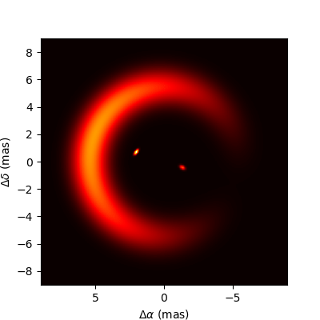

Synthetic observations of a binary system and rotating skewed disk
==================================================================

These scripts were used to generate synthetic observations for a presentation
(will be available online later) at the [Horizons for Optical Long Baseline
Interferometry](https://horizons-olbin.sciencesconf.org) workshop in Meudon,
France in January 2025. The synthetic observations were generated for the [P115
configuration](https://www.eso.org/sci/facilities/paranal/telescopes/vlti/configuration/P115.html)
of the ATs at the VLTI, assuming "ideal" _uv_-coverage spaced over an imaging
slot (ISL) of about two weeks. The underlying model is a rotating binary
surrounded by a skewed ring, the illumintation of which follows the brighter
component of the binary. The orbital period of the system, as well as the
rotational period of the ring, is 20 days, meaning the source appearance on the
sky changes significantly over the span of the ISL (by design).  

## Requirements

Besides the regular numpy/matplotlib/astropy/etc. requirements, these scripts
require the following modules to run:

 - [twobody](https://github.com/adrn/TwoBody) for the orbital solution of the binary;
 - [astroplan](https://github.com/astropy/astroplan) for the computing observation times etc.;
 - [oimodeler](https://github.com/oimodeler/oimodeler) for the actual model of the system and visibility computations;

## Usage

You should first run `makeemptyoifits.py`, which creates the basic oifits files
(one for each telescope configuration and night) without computing any
visibilities. The files created (`epoch??.fits` and `merged.fits`) contain
`OI_VIS`, `OI_VIS2` and `OI_T3` tables with _uv_ coordinates, observation times
and targets all set, but with zeros for the actual measurements. The
measurement uncertainties, which will be used later, are set to reasonable
values for
[VLTI/MATISSE](https://www.eso.org/sci/facilities/paranal/instruments/matisse.html)
as of January 2025.

Once the base empty files have been created, `basemodel.py` can be used to fill
them with the measurement values simulated through oimodeler, which are then
normally distributed using the uncertainties previously stored. For now, you
have to set `oifn` in `basemodel.py` manually to the oifits file you want to
fill in. The `doAnimation` variable can be set if you just want to look at an
animation of the system as computed by oimodeler over one period.

## Disclaimer

This is a toy model intended for demonstration purposes only.

## Contact

[Paul Boley](https://github.com/pboley)
