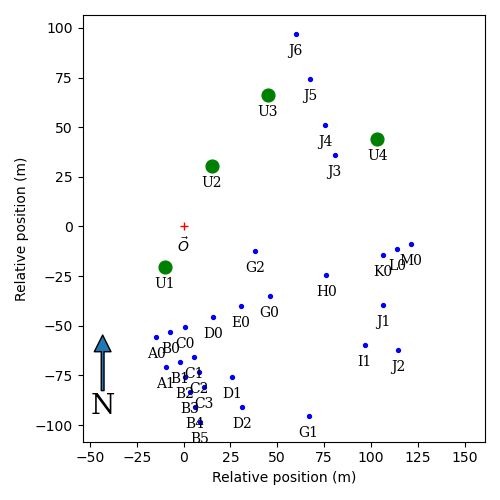

Example scripts
===============

Some example scripts using the module. These are not necessarily well documented
or working with the latest version, but may prove useful in getting started.

## `Horizons2025` directory

These scripts were used to generate synthetic observations for a presentation
(will be available online later) at the [Horizons for Optical Long Baseline
Interferometry](https://horizons-olbin.sciencesconf.org) workshop in Meudon,
France in January 2025. See separate documentation within the directory.

## `cflux_to_oifits2.py`

Before OIFITS2, there was no agreed upon way to store correlated fluxes within
oifits files. As an ad hoc solution in the days of MIDI, (see, for example
[these files](https://cdsarc.cds.unistra.fr/ftp/J/A+A/558/A24/fits/)), I had
added this information into the `CFLUX` and `CFLUXERR` columns of the OI_VIS
tables. The current version of the module also handles reading files like this,
however since this information can now be saved in a fully standarized way
(since OIFITS2), the code here can be used to convert those old OI_VIS rev1
tables with correlated flux information appended into sets of two OI_VIS rev2
tables (one for the visibility amplitude, one for the correlated flux).

## `make_vlti_array.py`

Generate an OI_ARRAY table from the [VLTI station position
data](https://www.eso.org/observing/etc/doc/viscalc/vltistations.html). Besides
the obvious uses for VLTI measurements, this can also be useful for seeing a
properly constructed OI_ARRAY table (there are many broken attempts in the
wild). The table generated by this script is also available as
`VLTI-array.fits`, which is plotted above using the `plot_array` function in
`oitools.py`.

Note that this file does not conform to the OIFITS standard in that it does not
contain any measurements, but you can use it (and others like it) in
constructing your own oifits files.

## `oitools.py`

Largely unmaintained and undocumented, but probably mostly working; may be
useful for seeing some operations with the oifits objects.

## `sample.py`

An example of creating an OIFITS file from scratch, which simulates using the
VLTI and MIDI (now decomissioned) for observations at random hour angles of the
calibrator star HD 148478, described as a uniform disk.

## Contact

[Paul Boley](https://github.com/pboley)